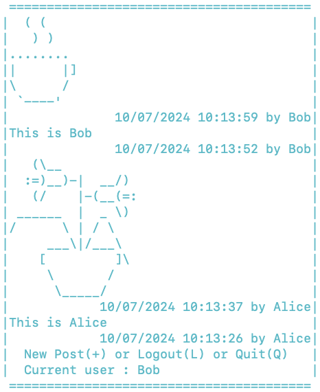
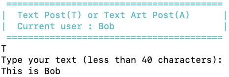
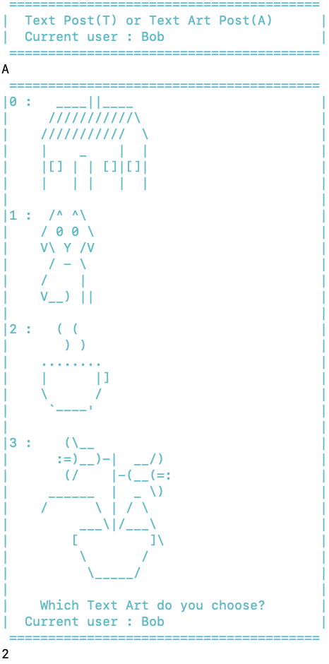

# Computer Science II
## Project - OOP

This is a project used in Computer Science II (CSCE 156) for Fall 2024 
in the [School of Computing](https://computing.unl.edu) 
at the [University of Nebraska-Lincoln](https://www.unl.edu).

## Overview

### Lab Objectives & Topics
Following the lab, you should be able to:
* use classes and objects to write Java programs
* understand inheritance and design classes and subclasses in Java
* understand and use interfaces and abstract classes in Java
* understand polymorphism in Java

### Peer Programming Pair-Up

At the beginning of each project, you may find a team member on your own.  Please ***sign
up for a group on Canvas*** (`People` then `Groups`), and only one member of your group needs to
submit your project on Canvas. If you prefer to work on this project by yourself, that is fine too.

## 1. Getting Started

Clone this project code for this project from GitHub in Eclipse using the
URL: `https://github.com/lisongxu/CSCE156-Project-OOP`. 

## 2. Social Media Application - Jstgram

In this project, we will design and develop a simple social media application using Java, called *Jstgram*. It supports two basic features

* Account management: A user can create a new account and log into an existing account.  
* Post management: A user can create various types of posts and list past posts.  

### 2.1 Main Window

When Jstgram starts, it should display the *Main Window* as shown below. This window is displayed by calling `Views.mainWindow()` in the provided `Views` class.

  

It reads the user input from the keyboard, and then goes to the *Account Registration Window* or the *Account Login Window*, or quits the application.

### 2.2 Account Registration Window

The *Account Registration Window* is demonstrated below. It asks the user for the account information, and you may creatively ask for more information, such as email and job. This window is displayed by calling `Views.accountRegistrationWindow()`.

  
 
After creating an account, Jstgram goes back to the *Main Window* so that a user can log in or create other new accounts.

### 2.3 Account Login Window

The *Account Login Window* with successful login and failed login are demonstrated below. Jstgaram asks for the username and password, and then compares them with the existing account information in `accounts`. This window is displayed by calling `Views.accountLoginWindow()`.

 

  

If the typed username and password match with an existing account,  this account is the current account and Jstgram goes to the *Post View Window* for the account; otherwise, it goes to the *Main Window*. Note that, at any time, there is at most one current account. 

### 2.4 Post View Window

The *Post View Window* lists all the past posts (by all accounts) in the descending order of the time, and then asks the user to create a new post, log out of the current account, or quit the application. Below is a possible *Post View Window* with a total of 4 posts. This window is displayed by calling `Views.postViewWindow()`.

  

After reading the user input, Jstgram 
* goes to the *New Post Window* to create a new post
* or logs out of the current account and goes back to the *Main Window*
* or quits the application. 

### 2.5  New Post Window

The *New Post Window* allows a user to create either a text post `T` or a text art post `A`. This window is displayed by calling `Views.newPostWindow()`.

Below is a demonstration where a user selects `T` and then types a text post.

  

Below is a demonstration where a user selects `A` and then chooses no 3 in the 4 predefined text art options. These text art options are defined as a `List<String[]>` constant `OPTIONS` in class `TextArtPost`. You are welcome to modify and add more text art options. The window of text art options is displayed by calling `Views.displayTextArtOptions()`.

  

After creating a post, Jstgram goes back to the *Post View Window*.

  

## 3. Project Requirement

### 3.1 Classes

You are provided with the following fully completed classes
* the `Views` class
* the `Post` abstract class
* the `PostContentFormatter` interface

You will write and complete the following partially completed classes
* the `Account` class
* the `TextPost` class
* the `TextArtPost` class
* the `Main` class, which is the class to run the application

You are free to define and write more methods and/or classes to handle account login, handle account registration, create new post, and list past posts.

### 3.2 Class Requirements

* The `Account` Class

    * The `Account` class must have 3 (or more) private data fields: `private String userName`, `private String password`, and `private String phoneNumber` and the corresponding public getter methods. 

* The `TextPost` and `TextArtPost` Classes

    * Both the `TextPost` and `TextArtPost` classes extend abstract class `Post`, because they use the same data fields, `postTime` and `postAccount`, defined in `Post`.
        * The `TextPost` class should have its own data field to store the text typed by a user.
        * The `TextArtPost` class should have its own data field to store the no of the text art chosen by a user. 

    * Both the `TextPost` and `TextArtPost` classes implement interface `PostContentFormatter` to override the `getFormattedContent()` method, which `Views.viewPost()` in the *Post View Window* calls to display each post in the appropriate format. 

* The `Main` Class
 
    * Please use a `HashMap` variable `accounts` to keep track of all account information. For each key-value pair, 
the key is the account username, and the value is the corresponding account. For example, statement `accounts.put(userName, new Account(userName, password, phoneNumber))` adds a new account to `accounts`.

    * Please use an `ArrayList<Post>` variable `postList` to store all the posts, which is the argument of method `Views.viewPost()`. 

## 4. Grading and Submitting Your Project

### 4.1 Grading by LAs

#### 4.1.1 Required features (100 points)

* (5 points) The `Account` class must have 3 (or more) private data fields: `private String userName`, `private String password`, and `private String phoneNumber` and the corresponding public getter methods. 

* (5 points) Both the `TextPost` and `TextArtPost` classes (not necessarily correctly) override the `getFormattedContent()` method.

* (5 points) A `HashMap` variable `accounts` is used to keep track of all account information

* (5 points) An `ArrayList<Post>` variable `postList` is used to store all the posts. 
  
* (10 points) A user can successfully create a new account (username=Alice, password=pass123), and then successfully log into the account.

* (10 points) Alice can then successfully create a new text post and the *Post View Window* correctly shows the post in the appropriate format as demonstrated above.

* (10 points) Alice can then successfully create a new text art post and the *Post View Window* correctly shows the post in the appropriate format as demonstrated above.

* (10 points) The *Post View Window* correctly shows these two posts in the descending order of their times.

* (10 points) When logging in using username=Bob (not created yet), it correctly reports a failed login.

* (10 points) A user can successfully create another new account (username=Bob, password=pass456), and then successfully log into the account.

* (10 points) Bob can then successfully create a new text post and a new text art post.

* (10 points) The *Post View Window* correctly shows all the posts in the descending order of their times.

#### 4.1.2 Bonus features (Additional points)

* (Bonus 5 points) Please attend lab sessions for detailed grading criteria on comments and coding style.

* (Bonus 20 points) There is a pre-registered Admin user. The Admin user can save all accounts (e.g., Alice and Bob) and all their posts to a text file (feel free to design your file format). After quitting and restarting the application, the Admin user can load the accounts and their posts from a file.

* (Bonus 10 points) A user can delete the current account, which deletes the username, password, and all the user's posts.  

* (Bonus 10 points) A user can choose how to sort the posts in the Post View Window. In addition to the default descending order of the time, a user can choose from the following additional orderings: ascending order of the time, ascending or descending order of usernames of the posts.  

### 4.2 Submitting to Canvas

Submit the following to Canvas (not GradeScope). Our LAs will manually grade them. You are welcome to demonstrate how your Jstgram works to our LAs, and they can then give you their feedback and grade your project.

1. `Project1.jar`: Follow the instructions below to generate a runnable JAR file that the LAs can execute.
   *  Step 1: Run your project at least once (create a `Launch Configuration` for step 4)
   *  Step 2: Right-click your project, and select `Export ...`
   *  Step 3: In the Java folder, select `Runnable JAR file`
   *  Step 4: In the `Runnable JAR File Specification`
       * select your project in `Launch Configuration`
       * change file name to `Project1.jar` in `Export destination`
       * select `Package required libraries into generated JAR` for `Library handling`
       * then click the `Finish` button
   * Type `java -jar Project1.jar` in the command line to test whether your JAR runs correctly.  

2. `Project1.zip`: A Zip file of all source files that the LAs can execute and check.

Again, if you plan to work with one other student on this project, please sign
up for a group on Canvas (`people` then `Groups`), and only one member of your group needs to
submit your project on Canvas.

## Credit

This project was originally designed by Jianghao Wang. Both David Ryckman and Olwen Nguyen helped to revise and improve it. 
